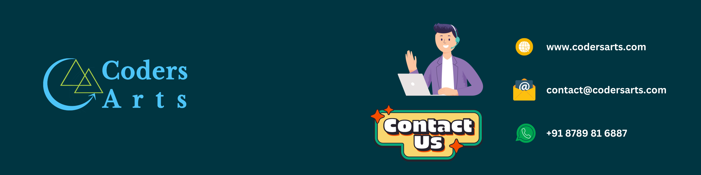

# Hi there 👋, welcome to the Codersarts GitHub profile!

**Codersarts builds AI systems, ships production software, and trains the engineers who maintain it.**

We work with startups and enterprise teams worldwide — from RAG pipelines and AI agents in production, to fixed-price MVPs, to 1:1 mentoring for developers levelling up. This profile is where we open-source the reference implementations, starter kits, and code snippets behind that work.

---

## 🌐 Our Platforms

| Platform | What It's For |
|---|---|
| [**Codersarts**](https://www.codersarts.com/) | Programming help, coding support, and engineering services |
| [**Codersarts AI**](https://www.ai.codersarts.com/) | Enterprise AI delivery — RAG systems, AI agents, LLM applications |
| [**Codersarts Build**](https://build.codersarts.com/) | Fixed-price MVP and SaaS product development |
| [**Codersarts Labs**](https://www.labs.codersarts.com/) | Courses, learning tracks, and technical education |
| [**Codersarts Training**](https://www.training.codersarts.com/) | 1:1 live training and personalized mentoring |
| [**Codersarts Dev**](https://www.codersarts.dev/) | Developer roadmaps, AI/ML source code library, tutorials |
| [**SofStack**](https://www.sofstack.com/) | Enterprise software services and dedicated engineering teams |

## 🚀 Products We've Built

| Product | Description |
|---|---|
| [**DocProcessing360**](https://docprocessing360.com/) | Intelligent document processing — extract, classify, and structure data from documents |
| [**TeleCues**](https://telecues.com/) | Teleprompter and on-camera cueing tool for creators and presenters |
| [**FlowArchitect**](https://flow.codersarts.dev/) | Visual workflow and architecture design tool for developers |
| [**Quizentia**](https://quizentia.com/) | AI-powered quiz and assessment generation SaaS |

---

## 🛠️ Services

### AI & Machine Learning

| Service | What We Deliver |
|---|---|
| RAG Systems | Retrieval-augmented generation pipelines, vector databases, knowledge-base chatbots |
| AI Agents | Autonomous and multi-agent systems, tool calling, orchestration frameworks |
| LLM Applications | Fine-tuning, prompt engineering, evaluation, and production LLM integration |
| Computer Vision | Object detection, OCR, image classification, video analytics |
| NLP | Text classification, entity extraction, summarization, sentiment analysis |
| MLOps & Deployment | Model serving, monitoring, CI/CD for ML, cloud deployment (AWS, GCP, Azure) |

### Product & Software Development

| Service | What We Deliver |
|---|---|
| MVP Development | Fixed-price, fixed-timeline MVPs for founders validating an idea |
| SaaS Platforms | Multi-tenant applications, billing, auth, admin dashboards |
| Web Development | React, Next.js, Node.js, Django, Flask, FastAPI, Spring Boot |
| Mobile Development | React Native, Flutter, native Android and iOS |
| API & Backend | REST and GraphQL APIs, microservices, third-party integrations |
| Cloud & DevOps | Docker, Kubernetes, CI/CD pipelines, infrastructure as code |

### Data & Automation

| Service | What We Deliver |
|---|---|
| Data Engineering | ETL/ELT pipelines, data warehousing, Spark, Airflow |
| Document Processing | Intelligent document extraction, OCR pipelines, AWS Textract workflows |
| Workflow Automation | n8n, LangChain, Zapier-style automations and internal tooling |
| Data Analysis & BI | Dashboards, reporting, visualization, statistical analysis |
| Web Scraping | Large-scale data collection, parsing, and cleaning |

### Engineering Support

| Service | What We Deliver |
|---|---|
| Coding Help | Hands-on support across Python, Java, JavaScript, C++, R, SQL, and more |
| Code Review | Structured reviews for correctness, security, and maintainability |
| Debugging & Troubleshooting | Root-cause analysis and fixes for stuck or broken codebases |
| Performance Optimization | Profiling, query tuning, refactoring, and scalability improvements |
| Architecture Consulting | System design, tech-stack selection, and technical due diligence |
| Technical Writing | Documentation, API references, architecture docs, tutorials |

### Training & Mentorship

| Service | What We Deliver |
|---|---|
| 1:1 Live Training | Personalized sessions in AI/ML, full-stack, data science, and more |
| Project-Based Courses | Build real applications with structured guidance and code reviews |
| Career Mentoring | Portfolio reviews, interview prep, and roadmap planning |
| Corporate Training | Team upskilling programs in AI, cloud, and modern engineering practices |
| Internships & Programs | Hands-on programs pairing learners with real production work |

---

## 📂 Explore Our Repositories

- 🤖 **AI & ML** — RAG chatbots, agent frameworks, fine-tuning workflows, model serving
- 🐍 **Python** — Django, FastAPI, Flask, data science and automation scripts
- 🌐 **Web & Mobile** — React, Next.js, Node.js, React Native, Flutter
- ☕ **Java & Backend** — Spring Boot, microservices, system design examples
- 📊 **Data Engineering** — ETL pipelines, Spark, SQL, dashboards
- 🧩 **Algorithms & Data Structures** — clean, documented reference implementations

Star what's useful, fork what you need, and open an issue if something's broken.

---

## 📬 Work With Us

Have a project, a stuck codebase, or an AI idea you want shipped?

📧 **contact@codersarts.com** · 🌐 [codersarts.com](https://www.codersarts.com/)

## Connect With Us

---

**Let's build something that ships. 🚀**

